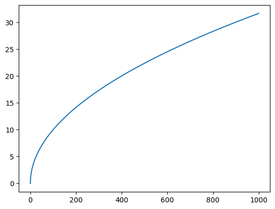
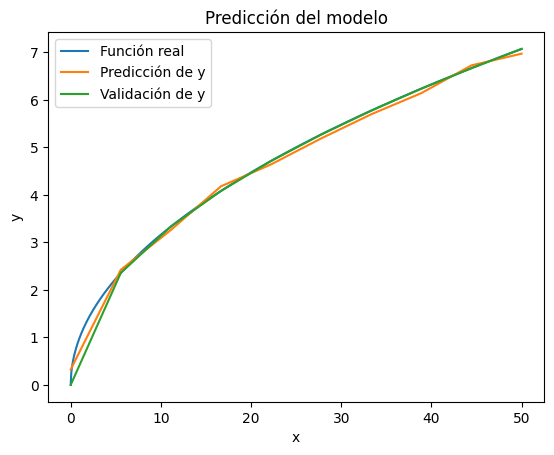

# Taller: Machine Learning

## Autores:
- Eduardo Cuadros
- Juan Barrera

## Punto 1

Considere la figura 6.1, tome una ecuación determinada, por ejemplo una raíz cúbica, o un
seno, genere un data set con muchos valores. Con base en ese data set y utilizando una
herramienta de ML, encuentre un modelo para el cálculo de la raíz cuadrada. Úselo con 10
ejemplos y compare los resultados con los que da la función del lenguaje.

Primero se importan las bibliotecas necesarias


```python
import numpy as np
import pylab as pl
from sklearn.svm import SVR
from sklearn.metrics import mean_squared_error
import math
```

Luego se crea el vector de puntos _X_ y la función respectiva _y_:

$$ y = \sqrt{x} $$


```python
X = np.linspace(0,1000, 800).reshape(-1,1)
y = np.sqrt(X).ravel()
```

Se puede visualizar la función en la siguiente Figura:

<p align="center">
  
</p>
Después de esto se procede a entrenar el modelo. Ya que la función que se va a predecir no es lineal, se escogió 
como modelo un **Support Vector Machine**. Los parámetros que se le dan son los siguientes:

- kernel: La función que se va a usar para transformar los datos es gaussiana.
- C: Es un parámetro regularizador. Controla que los pesos w no se sobreajusten.
- Epsilon: Es el margen de tolerancia para el error de predicción.

```python
model = SVR(kernel='rbf', C=100, gamma=0.01, epsilon=0.1)
model.fit(X,y.ravel())
```


Luego de esto se prueba el modelo con otros datos 

```python
X_test = np.linspace(0, 1000, 10).reshape(-1,1)
y_test = np.sqrt(X_test)
y_pred = model.predict(X_test)
```

Una vez se hicieron las predicciones, se usa la métrica del **Error Cuadrático Medio** para medir
el error que se obtuvo entre los valores predichos y los reales, obteniendo un valor de 0.05 . También se procede a visualizar los datos predichos en la siguiente gráfica.

<p align="center">
  
</p>

